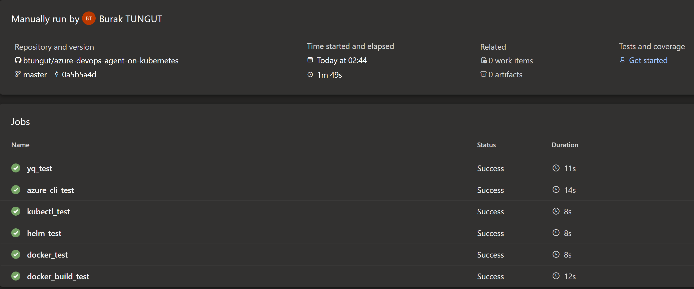

[](https://artifacthub.io/packages/helm/btungut/azure-devops-agent)
[](https://github.com/btungut/azure-devops-agent-on-kubernetes/releases)
[](https://github.com/btungut/azure-devops-agent-on-kubernetes/blob/master/LICENSE)

# Azure DevOps Agent on Kubernetes

The easiest and most effective method for creating and managing Azure DevOps agents on Kubernetes, without the need to spend time and effort wrestling with settings! Scale-out as much as is necessary and demolish them gracefully.

## Important Release Notes
### Non Root User Support
Since the **1.0.8 release** , the Dockerfile and Helm chart have been configured to utilize a non-root user. 

:white_check_mark: [Issue : Non-root user should be implemented](https://github.com/btungut/azure-devops-agent-on-kubernetes/issues/3)

:white_check_mark: [Issue : docker could be called without sudo](https://github.com/btungut/azure-devops-agent-on-kubernetes/issues/5)

## Prerequisites
- Helm
- Personal Access Token _with Agent Pool manage scope_


You don't need to follow any more instructions beyond the **standard self-hosted agent installation** in order to utilize this helm chart.

## Generate PAT on Azure DevOps

It is pretty straight-forward process with sufficient scope. Please choose **one of** the links below to generate a PAT.

> :warning: Only the PAT creation procedures are required

- [Create a PAT](https://docs.microsoft.com/en-us/azure/devops/organizations/accounts/use-personal-access-tokens-to-authenticate?view=azure-devops&tabs=Windows#create-a-pat)
- [Authenticate with a personal access token (PAT)](https://docs.microsoft.com/en-us/azure/devops/pipelines/agents/v2-linux?view=azure-devops#authenticate-with-a-personal-access-token-pat)

## Installing the Chart


1. First you need to add repository _(if you haven't done yet before)_
```bash
helm repo add btungut https://btungut.github.io
```

2. Install the helm chart with required parameters
  - With bash: 
```bash
helm install {RELEASE-NAME} btungut/azure-devops-agent \
  --set agent.pat={PAT} \
  --set agent.organizationUrl=https://dev.azure.com/{YOUR-ORG} \
  --namespace {YOUR-NS}
```

  - With powershell: 
```powershell
helm install {RELEASE-NAME} btungut/azure-devops-agent `
  --set agent.pat={PAT} `
  --set agent.organizationUrl=https://dev.azure.com/{YOUR-ORG} `
  --namespace {YOUR-NS}
```

## Uninstalling the Chart

Run the following snippet to uninstall the release:
```bash
helm delete {RELEASE-NAME}
```

## Parameters

### Agent authentication parameters

> :warning: Helm chart provides two option for authentication. Please use only one of them.

| Name                | Description                                           | Value                 |
| ------------------- | ----------------------------------------------------- | --------------------- |
| `agent.pat` | (1st Option) Personal access token for authentication                                   | `""`   |
| `agent.patSecret` | (2nd Option) Already existing secret name that stores PAT                         | `""`   |
| `agent.patSecretKey` | (2nd Option) Key (field) name of the PAT that is stored in secret              | `"pat"`|


### Agent configuration parameters

| Name                | Description                                           | Value                 |
| ------------------- | ----------------------------------------------------- | --------------------- |
| `agent.organizationUrl` | Server / organization url, e.g.: https://dev.azure.com/your-organization-name                                   | `""`   |
| `agent.pool` | Agent pool name which the build agent is placed into                                   | `"Default"`   |
| `agent.workingDirectory` | Working directory of the agent                                   | `"_work"`   |
| `agent.extraEnv` | Additional environment variables as dictionary                                   | `{}`   |

### Other parameters

| Name                | Description                                           | Value                 |
| ------------------- | ----------------------------------------------------- | --------------------- |
| `image.repository`  | Azure DevOps agent image repository                           | `btungut/azure-devops-agent`       |
| `image.tag`         | Azure DevOps agent image tag (immutable tags are recommended) | `3.220.5` |
| `image.pullPolicy`  | Azure DevOps agent image pull policy                          | `IfNotPresent`        |
| `image.pullSecrets` | Azure DevOps agent image pull secrets                         | `[]`                  |
| `replicaCount` | Replica count for deployment                        | `1`                  |
| `resources.requests.cpu` | CPU request value for scheduling                        | `"100m"`                  |
| `resources.requests.memory` | Memory request value for scheduling                        | `"128Mi"`                  |
| `resources.limits.cpu` | CPU limit value for scheduling                        | `"500m"`                  |
| `resources.limits.memory` | Memory limit value for scheduling                        | `"512Mi"`                  |
| `volumes` | Volumes for the container | `[]`                  |
| `volumeMounts` | Volume mountings | `[]`                  |

Please refer the values.yaml for other parameters.

## Built-in binaries & packages
The binaries and packages listed below are included in the docker image used by the helm chart:
- Ubuntu 18.04
- unzip
- jq
- yq
- git
- helm
- kubectl
- Powershell Core
- Docker CLI
- Azure CLI
  - with Azure DevOps extension

## Testing
Docker images which built from the Dockerfile located in this repository can be tested with the Azure DevOps Yaml pipeline that located into `./test/azdo-pipeline.yml`

